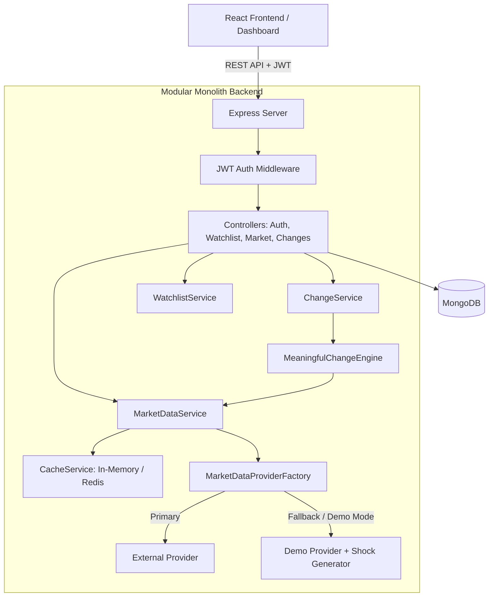

# PulseWatch — Smart Market Watchlist

> **Tagline:** *Know what changed. Know what matters.*

PulseWatch is an intelligent market briefing and smart watchlist platform built for the **"Code, by Groww"** hackathon. 

Unlike traditional financial watchlists that overwhelm users with static tables of fluctuating numbers, PulseWatch transforms market data into a personalized **"Return Brief"**. When users return after being away, PulseWatch instantly answers two fundamental questions:
1. **WHAT changed** since their last visit?
2. **WHY does it matter** (quantified context: z-score volatility multipliers, 20-day volume anomalies, away price delta)?

---

## 🌟 Key Differentiating Features

- **Personalized "Return Brief"**: Calculates away duration (e.g. `8h 42m`) and highlights stocks with meaningful price or volume shifts since the user was last active.
- **Meaningful Change Engine**: Multi-factor statistical engine scoring stock events from `0 to 100` and classifying severity into 🔴 **SIGNIFICANT**, 🟡 **WORTH WATCHING**, and 🟢 **NORMAL**.
- **Quantified Intelligence Context**: Explains *why* an alert triggered (e.g., `"Today's movement is 2.4× its typical daily movement"`, `"Volume is 2.1× its 20-day average"`).
- **Session State Persistence & Acknowledgements**: Persists `lastSeenPrice`, `lastSeenAt`, and `lastSeenChangeScore` per stock in `UserStockState`. Acknowledging updates updates baseline states so old alerts aren't endlessly repeated.
- **Data Freshness Tagging & Resilience**: Classifies quotes into `LIVE` (<1m), `RECENT` (1-5m), `DELAYED` (5-15m), and `STALE` (>15m) with automatic fallback and data validation.
- **Built-in Demo Market Shock Simulator**: Floating control panel designed for hackathon judging allowing live injection of market shocks (e.g., INFY +5.2%, HDFCBANK -3.8%) without requiring live exchange credentials.

---

## 📐 System Architecture



---

## 🧠 Meaningful Change Engine Formula

The engine calculates a normalized **Change Score (0 - 100)**:

$$\text{Change Score} = S_{\text{price}} + S_{\text{volume}} + S_{\text{away}} + S_{\text{signals}}$$

1. **Price Movement z-Score ($S_{\text{price}}$, max 35 pts)**:
   $$z = \frac{|\Delta\%_{\text{today}}|}{\sigma_{\text{daily}}}$$
   Measures movement standard deviation relative to historical baseline volatility.
2. **Volume Anomaly Ratio ($S_{\text{volume}}$, max 25 pts)**:
   $$\text{Ratio} = \frac{\text{Volume}_{\text{today}}}{\text{Volume}_{\text{20D Avg}}}$$
   Ratios $\ge 1.8\times$ trigger volume anomaly warnings.
3. **Away Movement Delta ($S_{\text{away}}$, max 20 pts)**:
   $$\Delta\%_{\text{away}} = \frac{\text{Price}_{\text{now}} - \text{Price}_{\text{lastSeen}}}{\text{Price}_{\text{lastSeen}}} \times 100$$
4. **Technical Signals ($S_{\text{signals}}$, max 20 pts)**:
   Proximity to 52-week high/low limits.

### Severity Classification:
- 🔴 **SIGNIFICANT** (Score $\ge 70$): Requires immediate trader attention.
- 🟡 **WORTH WATCHING** (Score $\ge 40$): Moderate shift worth keeping an eye on.
- 🟢 **NORMAL** (Score $< 40$): Fluctuation within standard expected bounds.

---

## 📁 Repository Structure

```
pulsewatch/
├── server/
│   ├── src/
│   │   ├── config/          # Threshold constants & DB connection
│   │   ├── models/          # User, Watchlist, UserStockState, MarketSnapshot
│   │   ├── providers/       # DemoMarketDataProvider, MarketDataProviderFactory
│   │   ├── services/        # MeaningfulChangeEngine, MarketDataService, ChangeService, CacheService
│   │   ├── controllers/     # REST API controllers
│   │   ├── middleware/      # Auth & Error handling
│   │   ├── routes/          # Versioned REST router (/api/v1/*)
│   │   ├── seed.js          # Seed script for demo setup
│   │   └── app.js           # Server entry point
│   └── tests/               # Vitest unit & integration tests
└── client/
    ├── src/
    │   ├── api/             # Axios API client
    │   ├── components/      # Navbar, ReturnBriefHeader, SignificantChangeCard, WatchlistTable, StockDetailModal, DemoControlBar
    │   ├── context/         # AuthContext & WatchlistContext
    │   ├── pages/           # Dashboard & AuthPage
    │   └── styles/          # Tailwind CSS theme tokens
    └── vite.config.js
```

---

## ⚡ Quick Start & Setup

### Prerequisites
- Node.js (v18+)
- MongoDB (Running locally or via URI)

### 1. Installation
```bash
# Install root, server, and client dependencies
npm run setup
```

### 2. Database Seeding (Recommended for Hackathon Demo)
Populates demo user (`demo@pulsewatch.io`), default watchlist, prior 8h away state, and INFY/HDFCBANK market shocks:
```bash
npm run seed
```

### 3. Start Development Servers
Runs both Express backend (`http://localhost:5000`) and Vite frontend (`http://localhost:3000`):
```bash
npm run dev
```

### 4. Demo Login Credentials
- **Email:** `demo@pulsewatch.io`
- **Password:** `Password123!`
*(Or use the 1-Click Hackathon Demo Access button on the login screen)*

---

## 🧪 Testing

Run unit tests for `MeaningfulChangeEngine`:
```bash
npm test
```

---

## 🔗 Key API Endpoints (`/api/v1`)

| Method | Endpoint | Description | Auth Required |
|---|---|---|---|
| `POST` | `/api/v1/auth/register` | Register new user | No |
| `POST` | `/api/v1/auth/login` | Login user & issue JWT | No |
| `GET` | `/api/v1/changes` | Get personalized Return Brief | Yes |
| `POST` | `/api/v1/session/acknowledge` | Acknowledge session changes | Yes |
| `GET` | `/api/v1/watchlists` | Get user watchlists | Yes |
| `POST` | `/api/v1/watchlists/:id/stocks` | Add stock to watchlist | Yes |
| `DELETE` | `/api/v1/watchlists/:id/stocks/:symbol` | Remove stock from watchlist | Yes |
| `GET` | `/api/v1/market/:symbol` | Get market quote with freshness | No |
| `GET` | `/api/v1/market/:symbol/history` | Get chart bars (1D-1Y) | No |
| `POST` | `/api/v1/market/simulate-shock` | Inject live shock for demo | No |

---

## 🚀 Future Scalability Roadmap

1. **Horizontal Worker Scaling**: Decouple market quote polling into dedicated background worker nodes with Redis Pub/Sub.
2. **WebSocket Push Notifications**: Stream live z-score anomaly breaches directly to active browser tabs via Socket.io.
3. **Multi-Source Aggregation**: Combine data from multiple market providers with real-time confidence rating and cross-validation.
